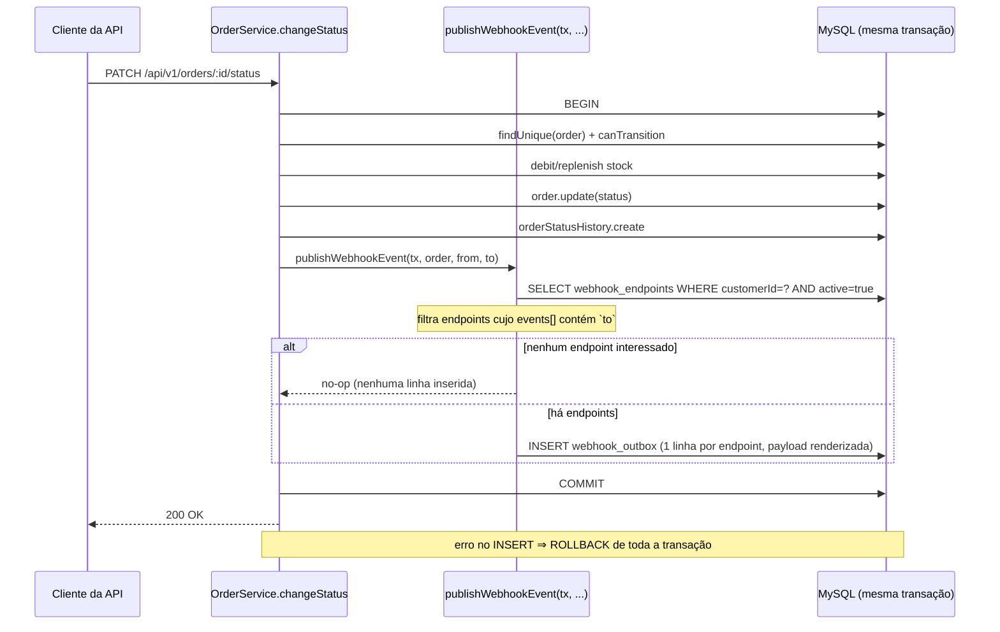
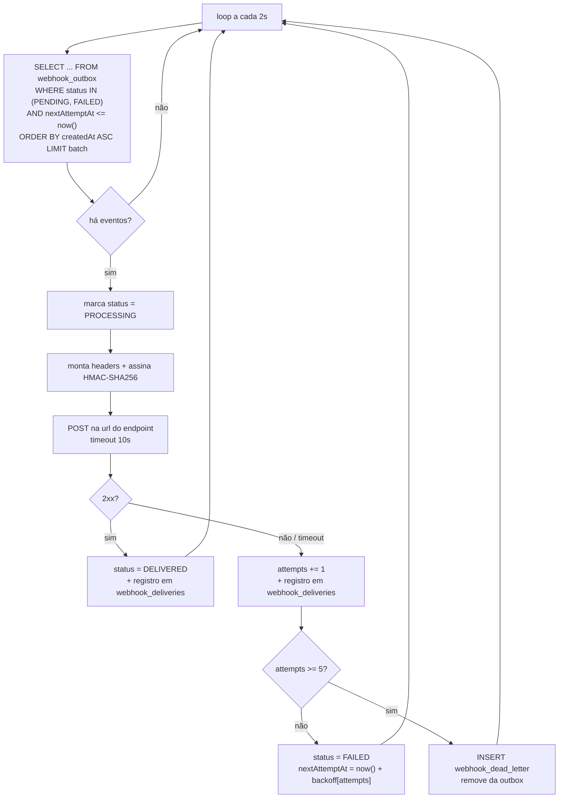

# FDD — Feature Design Document: Sistema de Webhooks de Notificação de Pedidos

| Campo | Valor |
|---|---|
| **Feature** | Sistema de Webhooks de Notificação de Pedidos |
| **Autor** | Ricardo Medeiros |
| **Status** | Pronto para implementação |
| **Data** | 2026-09-23 |
| **Fonte** | `TRANSCRICAO.md` + código do repositório |
| **Documentos relacionados** | [PRD](PRD.md) · [RFC](RFC.md) · [ADRs](adrs/README.md) · [Tracker](TRACKER.md) |

> Este documento detalha **como construir**. As decisões que o sustentam estão nos [ADRs](adrs/README.md); a proposta em nível de arquitetura e as questões em aberto estão no [RFC](RFC.md).
>
> **Convenção de origem:** itens marcados com timestamp `[hh:mm] Nome` vêm da transcrição da reunião. Itens marcados com **(inferência de desenho)** não foram discutidos e são proposta deste documento, sujeitas a revisão.
>
> **Convenção de caminhos:** todo caminho de arquivo citado neste documento **existe hoje** no repositório, com duas exceções, que são justamente os artefatos que esta feature cria: `src/modules/webhooks/` e `src/worker.ts`. Ambos aparecem sempre marcados como **(a criar)**.

---

## 1. Contexto e motivação técnica

O OMS não possui hoje nenhum mecanismo de notificação externa, evento ou fila. A varredura por `webhook`, `outbox`, `queue`, `retry` ou `EventEmitter` em `src/`, `prisma/` e `tests/` não retorna nenhuma ocorrência, e `package.json` não declara nenhum cliente HTTP.

A mudança de status de um pedido acontece em `src/modules/orders/order.service.ts`, no método `changeStatus`, inteiramente dentro de `this.prisma.$transaction(async (tx) => ...)`. A transação atual faz, nesta ordem:

1. `tx.order.findUnique` com `include: { items: true }`;
2. valida a transição com `canTransition` de `src/modules/orders/order.status.ts`, lançando `InvalidStatusTransitionError` quando inválida;
3. debita ou repõe estoque conforme `shouldDebitStock` / `shouldReplenishStock`;
4. `tx.order.update` com o novo status;
5. `tx.orderStatusHistory.create` registrando `fromStatus`, `toStatus`, `changedById` e `reason`;
6. relê o pedido com relações e retorna.

O desafio técnico é acoplar a emissão do evento a essa transação **sem** acoplar a latência da operação de negócio à disponibilidade de terceiros — e sem perder evento nenhum: "Não pode ter caso de status mudar e evento não sair" ([09:40] Bruno).

A solução é o padrão Outbox ([ADR-001](adrs/ADR-001-outbox-no-mysql.md)) com um worker separado em polling ([ADR-002](adrs/ADR-002-worker-processo-separado-polling.md)).

---

## 2. Objetivos técnicos

1. **Atomicidade:** o evento é gravado na mesma transação que altera o status; rollback da transação elimina o evento, falha ao gravar o evento derruba a mudança de status ([09:06] Diego, [09:40] Bruno).
2. **Latência de entrega abaixo de 10 segundos** em condição normal, com ciclo de polling de 2 segundos ([09:02] Marcos, [09:09] Diego).
3. **Resiliência a indisponibilidade do destinatário** por até ~15 horas, sem intervenção humana ([09:17] Diego).
4. **Autenticidade e integridade verificáveis** pelo cliente, via HMAC-SHA256 com secret por endpoint ([09:20], [09:21] Sofia).
5. **Zero alteração** nos mecanismos transversais existentes: middleware de erro, logger e validação permanecem intactos ([09:29] Bruno).
6. **Isolamento operacional:** o worker roda em processo próprio, com ciclo de vida independente da API ([09:11] Diego).

---

## 3. Escopo e exclusões

### 3.1 Incluso

- Módulo `src/modules/webhooks/` **(a criar)** com controller, service, repository, routes e schemas ([09:27] Bruno).
- Entrypoint `src/worker.ts` **(a criar)** e script `npm run worker` ([09:11] Larissa).
- Quatro tabelas novas no MySQL e uma migration Prisma.
- Emissão de evento na transição de status de pedido ([09:40] Bruno).
- CRUD de configuração de webhook, rotação de secret, histórico de entregas e replay de DLQ.

### 3.2 Excluído

| Exclusão | Origem |
|---|---|
| Notificação por e-mail ao cliente após falhas | [09:37] Larissa — próxima fase |
| Dashboard visual para o cliente | [09:40] Larissa — projeto do time de frontend |
| Webhooks inbound (cliente → plataforma) | [09:02] Marcos — só outbound |
| Arquivamento/expurgo das linhas entregues | [09:08] Diego — fora do escopo da feature |
| Rate limiting de saída por cliente | [09:39] Diego, [09:39] Larissa — observar e decidir depois |
| Múltiplos workers / ordering global | [09:13] Diego — problema do futuro |
| Eventos que não sejam mudança de status de pedido | Só `order.status_changed` foi definido ([09:43] Diego) |

---

## 4. Modelo de dados

Quatro tabelas novas em `prisma/schema.prisma`, seguindo as convenções já usadas no arquivo: `id String @id @default(uuid()) @db.Char(36)` ([09:51] Larissa), nomes de tabela em snake_case via `@@map` e valores monetários em `Int` de centavos.

### 4.1 `webhook_endpoints` — configuração do cliente

| Campo | Tipo | Notas |
|---|---|---|
| `id` | `String` uuid `@db.Char(36)` | identificador enviado ao cliente no header `X-Webhook-Id` ([09:44] Sofia) |
| `customerId` | `String @db.Char(36)` | FK para `customers`; não vem do JWT ([09:32] Larissa) |
| `url` | `String @db.VarChar(2048)` | obrigatoriamente `https` ([09:23] Sofia) |
| `secret` | `String @db.VarChar(128)` | secret vigente, gerada pela plataforma ([09:31] Marcos) |
| `previousSecret` | `String? @db.VarChar(128)` | secret anterior durante a rotação ([09:21] Sofia) |
| `previousSecretExpiresAt` | `DateTime?` | vigente + 24h a partir da rotação ([09:21] Sofia) |
| `events` | `Json` | lista de `OrderStatus` que este endpoint quer ouvir ([09:33] Marcos) |
| `active` | `Boolean @default(true)` | estado ativo ([09:21] Bruno) |
| `createdAt` / `updatedAt` | `DateTime` | padrão dos demais models |

Índices: `@@index([customerId])`, `@@index([active])`. **(inferência de desenho)** — coerente com os índices já existentes em `Order`.

### 4.2 `webhook_outbox` — eventos a entregar

| Campo | Tipo | Notas |
|---|---|---|
| `id` | `String` uuid `@db.Char(36)` | **é o `event_id`** enviado em `X-Event-Id` ([09:25] Diego, [09:51] Larissa) |
| `webhookEndpointId` | `String @db.Char(36)` | endpoint destinatário desta linha |
| `orderId` | `String @db.Char(36)` | pedido de origem |
| `eventType` | `String @db.VarChar(64)` | `order.status_changed` ([09:43] Diego) |
| `payload` | `Json` | snapshot renderizado na inserção ([09:52] Larissa) — ver [ADR-007](adrs/ADR-007-payload-snapshot-na-insercao-do-outbox.md) |
| `status` | enum `PENDING \| PROCESSING \| FAILED \| DELIVERED` | os quatro estados citados em ([09:08] Diego) |
| `attempts` | `Int @default(0)` | tentativas já realizadas, teto 5 ([09:15] Diego) |
| `nextAttemptAt` | `DateTime` | quando o worker pode tentar de novo; na criação, `now()` |
| `lastError` | `String? @db.Text` | motivo da última falha |
| `createdAt` / `updatedAt` | `DateTime` | ordenação de processamento por `createdAt` ([09:12] Diego) |

Índices: `@@index([status, nextAttemptAt])` e `@@index([createdAt])` — a reunião determinou índice no campo de status e em `created_at` ([09:08] Diego); a composição com `nextAttemptAt` é **(inferência de desenho)** para suportar o filtro de backoff na mesma varredura.

> **Fan-out — (inferência de desenho).** Cada linha da outbox tem **um** endpoint destinatário. Um cliente com dois webhooks interessados no mesmo status gera duas linhas, com `event_id` distintos. A alternativa (uma linha por evento, fan-out no envio) não sobrevive ao desenho decidido: `X-Event-Id` precisa ser único por envio para a deduplicação do cliente ([09:25] Diego), `X-Webhook-Id` identifica o cadastro que recebeu ([09:44] Sofia), e o retry é por destinatário ([09:15] Diego) — um cliente fora do ar não pode fazer o outro esperar. **Ponto para confirmação dos revisores.**

### 4.3 `webhook_deliveries` — histórico de entregas

Atende ao requisito de "esses são os últimos 100 webhooks que vocês mandaram pra mim, sucesso/falha, payload, response, tempo de resposta" ([09:34] Marcos).

| Campo | Tipo | Notas |
|---|---|---|
| `id` | `String` uuid `@db.Char(36)` | |
| `webhookEndpointId` | `String @db.Char(36)` | |
| `eventId` | `String @db.Char(36)` | id da linha de outbox que originou a tentativa |
| `attempt` | `Int` | número da tentativa (1 a 5) |
| `success` | `Boolean` | |
| `responseStatus` | `Int?` | nulo em timeout ou erro de conexão |
| `responseBody` | `String? @db.Text` | truncado — ver §7.4 |
| `durationMs` | `Int` | tempo de resposta ([09:34] Marcos) |
| `createdAt` | `DateTime` | |

Índices: `@@index([webhookEndpointId, createdAt])`, `@@index([eventId])`. **(inferência de desenho)**

### 4.4 `webhook_dead_letter` — DLQ

"Uma tabela `webhook_dead_letter` separada, com a payload, motivo da falha e timestamp" ([09:18] Diego).

| Campo | Tipo | Notas |
|---|---|---|
| `id` | `String` uuid `@db.Char(36)` | é o `:id` do endpoint de replay ([09:35] Diego) |
| `originalEventId` | `String @db.Char(36)` | `id` da linha de outbox original |
| `webhookEndpointId` | `String @db.Char(36)` | |
| `payload` | `Json` | payload exata que falhou ([09:18] Diego) |
| `failureReason` | `String @db.Text` | motivo da falha ([09:18] Diego) |
| `attempts` | `Int` | tentativas consumidas |
| `replayedAt` | `DateTime?` | preenchido quando um `ADMIN` reprocessa **(inferência de desenho)** |
| `replayedById` | `String? @db.Char(36)` | quem executou o replay — exigência de auditoria ([09:36] Sofia) |
| `createdAt` | `DateTime` | timestamp ([09:18] Diego) |

---

## 5. Fluxos detalhados

### 5.1 Criação do evento na outbox (síncrono, transacional)



Pontos de desenho:

- **A assinatura é `publishWebhookEvent(tx, order, fromStatus, toStatus)`**, recebendo o `tx` da transação corrente, em vez de injetar um repository inteiro no `OrderService` — "função pura recebendo o tx" ([09:41] Bruno, [09:41] Diego).
- **O filtro de eventos é aplicado aqui, na inserção**, e não no envio: se nenhum webhook do cliente quer aquele status, a linha nem é criada, economizando linha na tabela ([09:34] Bruno, [09:34] Diego).
- **A payload é renderizada agora** e persistida como snapshot ([09:52] Larissa).
- **Falha em qualquer ponto derruba tudo** ([09:41] Diego).

### 5.2 Processamento pelo worker



- **Batch pequeno** de eventos pendentes mais antigos, processados em ordem de `createdAt` ([09:08] Diego, [09:12] Diego). O tamanho do batch não foi discutido — **(inferência de desenho)**: começar com 20 e ajustar por medição.
- **Worker único** ([09:12] Diego): não há lock distribuído nesta fase. O estado `PROCESSING` protege contra duplo processamento em caso de reinício concomitante.
- O worker abre **seu próprio `PrismaClient`** ([09:30] Bruno), conectando à mesma `DATABASE_URL`.

### 5.3 Retry e backoff

| Tentativa | Espera após a falha anterior | Tempo acumulado |
|---|---|---|
| 1 (imediata) | — | 0 |
| 2 | 1 minuto | ~1 min |
| 3 | 5 minutos | ~6 min |
| 4 | 30 minutos | ~36 min |
| 5 | 2 horas | ~2h36 |
| — (DLQ) | 12 horas | **~14h36** |

Progressão definida em ([09:17] Diego), com o total de "quase 15 horas entre primeira falha e última tentativa"; teto de 5 tentativas ([09:15] Diego, [09:16] Larissa).

**Conta como falha:** qualquer resposta fora da faixa 2xx, erro de conexão/DNS/TLS, ou ausência de resposta em **10 segundos** ([09:42] Diego).

### 5.4 DLQ e replay

Esgotadas as cinco tentativas, o evento é movido para `webhook_dead_letter` com payload, motivo e timestamp ([09:18] Diego), e sai da outbox — a leitura da outbox principal fica limpa ([09:18] Diego).

O replay é **manual**, via `POST /api/v1/admin/webhooks/dead-letter/:id/replay` ([09:35] Diego), restrito a `ADMIN` ([09:36] Sofia), e recoloca o evento na outbox como pendente ([09:18] Diego) — com `attempts` zerado, `status = PENDING` e `nextAttemptAt = now()`. A operação registra em log quem a executou, para auditoria ([09:36] Sofia).

---

## 6. Contratos públicos

Todos os endpoints são montados sob o prefixo `/api/v1`, conforme `app.use('/api/v1', buildApiRouter(controllers))` em `src/app.ts`, e passam pelo `authenticate` de `src/middlewares/auth.middleware.ts` ([09:32] Marcos, [09:32] Larissa). Erros seguem o envelope de `src/middlewares/error.middleware.ts`: `{ "error": { "code", "message", "details"? } }`.

### 6.1 `POST /api/v1/webhooks` — cadastrar endpoint

Origem: ([09:31] Marcos). Secret gerada pela plataforma e devolvida **apenas nesta resposta**.

**Request**

```json
{
  "customerId": "6f3a1d64-0b2e-4a77-9f0c-2a1b8c5d4e33",
  "url": "https://atlas-comercial.example.com/hooks/oms",
  "events": ["SHIPPED", "DELIVERED"]
}
```

**Response `201 Created`**

```json
{
  "id": "b81c2f7a-55e1-4c39-9a0d-7e6f3b2c1d90",
  "customerId": "6f3a1d64-0b2e-4a77-9f0c-2a1b8c5d4e33",
  "url": "https://atlas-comercial.example.com/hooks/oms",
  "events": ["SHIPPED", "DELIVERED"],
  "active": true,
  "secret": "whsec_9f2c1a7b4e8d3f60a5b2c9d1e4f7a0b3",
  "createdAt": "2026-09-23T13:04:11.000Z"
}
```

**Status codes:** `201` criado · `400` `WEBHOOK_INVALID_URL` (URL não-`https`) ou `VALIDATION_ERROR` · `401` sem token · `404` `NOT_FOUND` (customer inexistente) · `422` `WEBHOOK_INVALID_EVENT_FILTER` (status fora do enum `OrderStatus`).

**Semântica:** `events` é a lista de status que este endpoint quer ouvir ([09:33] Marcos). O campo `secret` não é retornado por nenhum outro endpoint.

### 6.2 `GET /api/v1/webhooks?customerId=...` — listar endpoints de um cliente

Origem: ([09:33] Bruno).

**Response `200 OK`** — usa o envelope `paginated()` de `src/shared/http/response.ts`, como os demais endpoints de listagem:

```json
{
  "data": [
    {
      "id": "b81c2f7a-55e1-4c39-9a0d-7e6f3b2c1d90",
      "customerId": "6f3a1d64-0b2e-4a77-9f0c-2a1b8c5d4e33",
      "url": "https://atlas-comercial.example.com/hooks/oms",
      "events": ["SHIPPED", "DELIVERED"],
      "active": true,
      "secretRotatedAt": null,
      "createdAt": "2026-09-23T13:04:11.000Z"
    }
  ],
  "pagination": { "page": 1, "pageSize": 20, "total": 1, "totalPages": 1 }
}
```

**Status codes:** `200` · `400` `VALIDATION_ERROR` · `401`.
**Semântica:** a secret **nunca** aparece na listagem.

### 6.3 `PATCH /api/v1/webhooks/:id` — editar endpoint

Origem: ([09:33] Bruno). Campos editáveis: `url`, `events`, `active`.

**Request**

```json
{ "events": ["PAID", "SHIPPED", "DELIVERED"], "active": true }
```

**Response `200 OK`**

```json
{
  "id": "b81c2f7a-55e1-4c39-9a0d-7e6f3b2c1d90",
  "url": "https://atlas-comercial.example.com/hooks/oms",
  "events": ["PAID", "SHIPPED", "DELIVERED"],
  "active": true,
  "updatedAt": "2026-09-23T14:20:03.000Z"
}
```

**Status codes:** `200` · `400` `WEBHOOK_INVALID_URL` · `401` · `404` `WEBHOOK_NOT_FOUND` · `422` `WEBHOOK_INVALID_EVENT_FILTER`.

### 6.4 `DELETE /api/v1/webhooks/:id` — remover endpoint

Origem: ([09:33] Bruno).

**Response `204 No Content`** (sem corpo), seguindo o padrão de `DELETE /orders/:id` em `src/modules/orders/order.controller.ts`.

**Status codes:** `204` · `401` · `404` `WEBHOOK_NOT_FOUND`.
**Semântica — (inferência de desenho):** eventos já na outbox para este endpoint são descartados na próxima varredura do worker; o histórico de entregas é preservado.

### 6.5 `POST /api/v1/webhooks/:id/rotate-secret` — rotacionar secret

Origem: ([09:21] Sofia). A secret antiga permanece válida por 24 horas em paralelo.

**Request:** sem corpo.

**Response `200 OK`**

```json
{
  "id": "b81c2f7a-55e1-4c39-9a0d-7e6f3b2c1d90",
  "secret": "whsec_4d7e1b93a0c62f85d3e7b0a9c1f4e2d6",
  "previousSecretExpiresAt": "2026-09-24T14:31:00.000Z",
  "rotatedAt": "2026-09-23T14:31:00.000Z"
}
```

**Status codes:** `200` · `401` · `404` `WEBHOOK_NOT_FOUND`.
**Semântica:** durante as 24h, envios continuam assinados com a secret **nova**; a antiga permanece registrada para que o cliente possa aceitar as duas durante a migração ([09:21] Sofia).

### 6.6 `GET /api/v1/webhooks/:id/deliveries` — histórico de entregas

Origem: ([09:34] Marcos) — "os últimos 100 webhooks que vocês mandaram pra mim, sucesso/falha, payload, response, tempo de resposta".

**Response `200 OK`**

```json
{
  "data": [
    {
      "id": "3c9e7a12-84bd-4f05-a6e1-9d2c0b7f5a48",
      "eventId": "e7d41a09-6c25-4b83-90fa-1d5e8c3b2704",
      "attempt": 2,
      "success": true,
      "responseStatus": 200,
      "responseBody": "{\"received\":true}",
      "durationMs": 342,
      "payload": {
        "event_id": "e7d41a09-6c25-4b83-90fa-1d5e8c3b2704",
        "event_type": "order.status_changed",
        "order_number": "ORD-000128",
        "from_status": "PROCESSING",
        "to_status": "SHIPPED"
      },
      "createdAt": "2026-09-23T14:35:02.000Z"
    }
  ],
  "pagination": { "page": 1, "pageSize": 100, "total": 1, "totalPages": 1 }
}
```

**Status codes:** `200` · `401` · `404` `WEBHOOK_NOT_FOUND`.
**Semântica — (inferência de desenho):** `pageSize` padrão 100, alinhado ao "últimos 100" pedido por Marcos; o teto de 100 segue o `pageSize` máximo já praticado em `src/modules/orders/order.schemas.ts`.

### 6.7 `POST /api/v1/admin/webhooks/dead-letter/:id/replay` — reprocessar evento morto

Origem: ([09:18] Diego, [09:35] Diego). **Exige role `ADMIN`** ([09:36] Sofia), aplicada com o `requireRole('ADMIN')` de `src/middlewares/auth.middleware.ts`.

**Request:** sem corpo.

**Response `202 Accepted`**

```json
{
  "deadLetterId": "a0f5c3d8-72b1-49e6-8c04-5f1a9e2b7d36",
  "newEventId": "de1b6f40-3a97-4c25-b8e0-6c4d2a7f91b5",
  "status": "PENDING",
  "replayedAt": "2026-09-23T15:02:44.000Z",
  "replayedById": "1a7c4e90-5b38-42d1-9f6a-0c8b3d5e2714"
}
```

**Status codes:** `202` aceito · `401` sem token · `403` `FORBIDDEN` (papel diferente de `ADMIN`) · `404` `WEBHOOK_DEAD_LETTER_NOT_FOUND` · `409` `WEBHOOK_ALREADY_REPLAYED`.
**Semântica:** recoloca o evento na outbox como pendente ([09:18] Diego) e registra em log quem executou, para auditoria ([09:36] Sofia).

### 6.8 Contrato de saída — o que o cliente recebe

**Headers** ([09:44] Diego, com `X-Webhook-Id` acrescentado por [09:44] Sofia):

| Header | Conteúdo |
|---|---|
| `Content-Type` | `application/json` |
| `X-Event-Id` | UUID do evento, gerado na inserção do outbox; estável entre tentativas ([09:25] Diego) |
| `X-Signature` | HMAC-SHA256 do corpo, com a secret do endpoint ([09:20] Sofia) |
| `X-Timestamp` | timestamp do envio, para o cliente detectar replay attack se quiser ([09:44] Diego) |
| `X-Webhook-Id` | id do cadastro de webhook, para clientes com vários endpoints ([09:44] Sofia) |

**Corpo** ([09:43] Diego) — deliberadamente **sem os itens do pedido**; quem precisar de detalhe consulta `GET /orders/:id` depois:

```json
{
  "event_id": "e7d41a09-6c25-4b83-90fa-1d5e8c3b2704",
  "event_type": "order.status_changed",
  "timestamp": "2026-09-23T14:35:01.482Z",
  "order_id": "9b2e7f10-4c85-4a36-b0d7-1e5a8c3f2946",
  "order_number": "ORD-000128",
  "from_status": "PROCESSING",
  "to_status": "SHIPPED",
  "customer_id": "6f3a1d64-0b2e-4a77-9f0c-2a1b8c5d4e33",
  "total_cents": 149900
}
```

**Resposta esperada do cliente:** qualquer `2xx` conta como sucesso. Qualquer outra coisa, ou ausência de resposta em 10 segundos, conta como falha ([09:42] Diego).

---

## 7. Matriz de erros

Todos os códigos do módulo usam o prefixo `WEBHOOK_` ([09:28] Bruno, [09:29] Larissa). As classes estendem as de `src/shared/errors/http-errors.ts`, no molde de `InvalidStatusTransitionError`, e são serializadas sem alteração pelo `errorMiddleware` ([09:29] Bruno).

### 7.1 Erros de API

| Código | HTTP | Classe base | Quando ocorre | Origem |
|---|---|---|---|---|
| `WEBHOOK_NOT_FOUND` | 404 | `NotFoundError` | endpoint de webhook inexistente | [09:28] Bruno |
| `WEBHOOK_INVALID_URL` | 400 | `BadRequestError` | URL ausente, malformada ou não-`https` | [09:28] Bruno, [09:23] Sofia |
| `WEBHOOK_SECRET_REQUIRED` | 400 | `BadRequestError` | operação que exige secret vigente sem secret disponível | [09:28] Bruno |
| `WEBHOOK_INVALID_EVENT_FILTER` | 422 | `UnprocessableEntityError` | `events` vazio ou com valor fora do enum `OrderStatus` | [09:33] Marcos + `src/modules/orders/order.status.ts` |
| `WEBHOOK_ENDPOINT_INACTIVE` | 409 | `ConflictError` | operação de entrega sobre endpoint desativado | [09:21] Bruno (campo `active`) |
| `WEBHOOK_DEAD_LETTER_NOT_FOUND` | 404 | `NotFoundError` | replay de id inexistente na DLQ | [09:35] Diego |
| `WEBHOOK_ALREADY_REPLAYED` | 409 | `ConflictError` | replay de evento já reprocessado | **(inferência de desenho)**, para tornar o replay idempotente |

### 7.2 Erros de entrega (worker — não retornam HTTP, são persistidos em `lastError` e `failureReason`)

| Código | Quando ocorre | Consequência | Origem |
|---|---|---|---|
| `WEBHOOK_DELIVERY_TIMEOUT` | cliente não respondeu em 10s | conta tentativa, agenda backoff | [09:42] Diego |
| `WEBHOOK_DELIVERY_FAILED` | resposta fora de 2xx, erro de conexão, DNS ou TLS | conta tentativa, agenda backoff | [09:15] Diego |
| `WEBHOOK_PAYLOAD_TOO_LARGE` | payload excede **64KB** | evento **não é enviado**; vai direto para a DLQ | [09:23] Sofia, [09:24] Diego |
| `WEBHOOK_MAX_RETRIES_EXCEEDED` | 5 tentativas consumidas | evento movido para `webhook_dead_letter` | [09:15] Diego |

> Sobre `WEBHOOK_PAYLOAD_TOO_LARGE`: Sofia foi explícita em preferir **erro a truncamento** — "se chegou nesse tamanho, tem algo errado" ([09:23]). O teto de 64KB foi fixado por Diego como generoso para os eventos reais ([09:24]) e classificado por Larissa como requisito não funcional, não como decisão arquitetural ([09:24]).

---

## 8. Estratégias de resiliência

| Aspecto | Definição | Origem |
|---|---|---|
| **Timeout de saída** | 10 segundos por tentativa | [09:42] Diego |
| **Tentativas** | 5 no total | [09:15] Diego |
| **Backoff** | 1m → 5m → 30m → 2h → 12h | [09:17] Diego |
| **Destino final** | `webhook_dead_letter` com payload, motivo e timestamp | [09:18] Diego |
| **Recuperação** | replay manual por `ADMIN` | [09:35] Diego, [09:36] Sofia |
| **Garantia de entrega** | at-least-once; dedup pelo cliente via `X-Event-Id` | [09:26] Larissa |
| **Garantia de emissão** | transacional — rollback da transação elimina o evento | [09:06] Diego |
| **Ordering** | por `order_id`, enquanto houver worker único | [09:12] Diego |
| **Proteção de tamanho** | rejeita payload > 64KB | [09:24] Diego, [09:24] Larissa |

**Fallback:** não há canal alternativo de notificação. O e-mail de aviso ao cliente foi explicitamente adiado para uma fase futura ([09:37] Larissa), então o único caminho de recuperação após a DLQ é o replay manual.

**Restart do worker — (inferência de desenho):** eventos deixados em `PROCESSING` por uma queda do processo precisam voltar a `PENDING`. Proposta: na inicialização, o worker reverte para `PENDING` as linhas em `PROCESSING` com `updatedAt` mais antigo que o timeout de 10s. Não foi discutido na reunião; **ponto para revisão**.

---

## 9. Observabilidade

Toda a instrumentação usa o logger Pino já existente em `src/shared/logger/index.ts` — "não vamos botar nada novo" ([09:29] Bruno).

### 9.1 Logs

Eventos estruturados propostos, seguindo o padrão de `logger.info({ ... }, 'http_request')` de `src/middlewares/request-logger.middleware.ts`:

| Evento | Campos | Nível |
|---|---|---|
| `webhook_event_enqueued` | `eventId`, `webhookEndpointId`, `orderId`, `fromStatus`, `toStatus` | `info` |
| `webhook_delivery_attempt` | `eventId`, `webhookEndpointId`, `attempt`, `responseStatus`, `durationMs` | `info` |
| `webhook_delivery_failed` | `eventId`, `attempt`, `errorCode`, `nextAttemptAt` | `warn` |
| `webhook_dead_lettered` | `eventId`, `webhookEndpointId`, `attempts`, `failureReason` | `error` |
| `webhook_dead_letter_replayed` | `deadLetterId`, `newEventId`, `replayedById` — exigência de auditoria ([09:36] Sofia) | `info` |
| `webhook_worker_tick` | `batchSize`, `pendingCount`, `durationMs` | `debug` |

**Redaction obrigatória:** a lista `redact` de `src/shared/logger/index.ts` hoje cobre `req.headers.authorization`, `*.password`, `*.passwordHash`, `*.token` e `*.accessToken`. Precisa passar a cobrir `*.secret`, `*.previousSecret` e `*.X-Signature` — a reunião registrou caso real de secret vazada em log de aplicação ([09:22] Diego).

### 9.2 Métricas

**(inferência de desenho)** — a reunião não definiu instrumentação de métricas; a lista abaixo é proposta deste documento, derivada dos limites que ela fixou:

| Métrica | Tipo | Por que existe |
|---|---|---|
| `webhook_outbox_pending_total` | gauge | detectar acúmulo — o gargalo do worker único ([09:12] Diego) |
| `webhook_outbox_oldest_pending_age_seconds` | gauge | **é a métrica que vigia o acordo de 10 segundos** ([09:02] Marcos) |
| `webhook_delivery_duration_ms` | histograma | relação com o timeout de 10s ([09:42] Diego) |
| `webhook_delivery_total{result}` | counter | taxa de sucesso/falha por endpoint |
| `webhook_retry_total{attempt}` | counter | saúde dos destinatários ao longo do backoff |
| `webhook_dead_letter_total` | counter | volume de falhas permanentes; base para reavaliar o e-mail adiado ([09:37] Larissa) |

### 9.3 Tracing

**(inferência de desenho).** O projeto não tem tracing distribuído hoje; a proposta é de correlação, não de nova stack:

- O `requestId` gerado em `src/middlewares/request-logger.middleware.ts` (header `X-Request-Id`) é propagado até a linha da outbox, ligando a requisição `PATCH /orders/:id/status` ao evento gerado.
- O `eventId` (`X-Event-Id`) é a chave de correlação do lado do worker: aparece em todas as tentativas, no histórico de entregas e na DLQ, e é o mesmo valor que o cliente recebe — o que permite investigar uma reclamação de ponta a ponta com um único identificador.

---

## 10. Dependências e compatibilidade

### 10.1 Dependências novas

| Dependência | Situação |
|---|---|
| **Cliente HTTP de saída** | O `package.json` **não tem nenhum** — sem axios, sem node-fetch. É a única dependência realmente nova da feature. Candidato natural é o `fetch` nativo do Node (o projeto exige `node >= 20`) com `AbortSignal.timeout(10_000)`. **Decisão em aberto** — ver RFC §5.5. |
| **HMAC-SHA256** | `node:crypto` da biblioteca padrão; nada a instalar ([09:20] Sofia) |
| **Geração de UUID** | `uuid` 11.0.3 já é dependência, e o Prisma gera `@default(uuid())` ([09:51] Larissa) |

### 10.2 Configuração

Novas variáveis a acrescentar no schema Zod de `src/config/env.ts`, seguindo o padrão fail-fast existente — **(inferência de desenho)**, com valores default vindos das decisões da reunião:

| Variável | Default | Origem do valor |
|---|---|---|
| `WEBHOOK_POLL_INTERVAL_MS` | `2000` | [09:09] Diego |
| `WEBHOOK_HTTP_TIMEOUT_MS` | `10000` | [09:42] Diego |
| `WEBHOOK_MAX_ATTEMPTS` | `5` | [09:15] Diego |
| `WEBHOOK_MAX_PAYLOAD_BYTES` | `65536` | [09:24] Diego |
| `WEBHOOK_SECRET_GRACE_HOURS` | `24` | [09:21] Sofia |
| `WEBHOOK_BATCH_SIZE` | `20` | (inferência de desenho) |

`.env.example` precisa refletir as novas variáveis.

### 10.3 Compatibilidade

- **Nenhuma alteração de contrato** nos endpoints existentes de `orders`, `products`, `customers`, `users` ou `auth`.
- **Nenhuma alteração de schema** nas tabelas existentes — só criação de tabelas novas.
- Os testes existentes em `tests/orders.test.ts` continuam válidos: sem webhook cadastrado para o cliente, `publishWebhookEvent` é no-op ([09:34] Bruno) e a transação se comporta exatamente como hoje.
- O `deleteMany` em ordem FK-safe de `tests/setup.ts` precisa incluir as quatro tabelas novas, antes de `order`/`customer`.

---

## 11. Integração com o sistema existente

Esta seção nomeia os arquivos reais do código base tocados pela feature e descreve o que muda em cada um.

### 11.1 `src/modules/orders/order.service.ts` — **a alteração crítica**

"A alteração crítica é dentro do service de orders, no método `changeStatus`" ([09:40] Bruno).

Hoje o método executa, dentro de `this.prisma.$transaction(async (tx) => ...)`: `tx.order.findUnique`, validação com `canTransition`, `debitStock`/`replenishStock`, `tx.order.update` e `tx.orderStatusHistory.create`. A extensão é **uma chamada**, inserida logo após `tx.orderStatusHistory.create` e antes da releitura do pedido:

```ts
await publishWebhookEvent(tx, order, from, to);
```

A função vem do módulo de webhooks e recebe o `tx` da transação corrente — "função pura recebendo o tx. Não precisa injetar repository inteiro" ([09:41] Diego). O construtor do `OrderService`, que hoje recebe `(orders: OrderRepository, prisma: PrismaClient)`, **não muda**. Qualquer exceção lançada pela função propaga e derruba a transação inteira, que é o comportamento desejado ([09:41] Diego).

O método `create` do mesmo arquivo, que registra o histórico inicial `null → PENDING`, **não é alterado**: a reunião tratou apenas de mudança de status ([09:40] Bruno), e nenhum cliente pediu evento de criação de pedido.

### 11.2 `src/shared/errors/http-errors.ts` — reuso da hierarquia de erros

"A gente já tem um padrão. Tem classe `AppError`, classes específicas tipo `InsufficientStockError`, `InvalidStatusTransitionError`. Quero seguir igual pra webhook" ([09:28] Bruno).

As classes novas estendem as existentes fixando o código, exatamente como `InvalidStatusTransitionError extends ConflictError` fixa `INVALID_STATUS_TRANSITION`:

```ts
export class WebhookNotFoundError extends NotFoundError { /* WEBHOOK_NOT_FOUND */ }
export class WebhookInvalidUrlError extends BadRequestError { /* WEBHOOK_INVALID_URL */ }
```

Como `NotFoundError` hoje não aceita um código customizado (fixa `NOT_FOUND`), os erros de webhook que precisam de código próprio devem estender `BadRequestError`, `ConflictError` ou `UnprocessableEntityError` — as três aceitam o parâmetro `code`. **Ponto de atenção para a implementação.**

### 11.3 `src/middlewares/error.middleware.ts` — **sem alteração**

"O middleware de erro centralizado já trata `AppError`, Zod e Prisma. Vai pegar nossos erros sem precisar mudar nada" ([09:29] Bruno). Como as classes novas descendem de `AppError`, o middleware já as serializa no envelope `{ error: { code, message, details? } }`. Nenhuma linha deste arquivo muda.

### 11.4 `src/middlewares/auth.middleware.ts` — autorização do replay

O endpoint de replay usa o `requireRole('ADMIN')` já existente neste arquivo ([09:36] Larissa: "a gente reaproveita o `requireRole` que já existe"). O padrão de uso está em `src/modules/users/user.routes.ts`, hoje o único lugar do projeto que aplica `requireRole('ADMIN')`. O `replayedById` sai de `req.user.id`, populado pelo `authenticate`.

Os demais endpoints do módulo ficam apenas com `authenticate`, sem restrição de papel ([09:37] Sofia: "por enquanto sim").

### 11.5 `src/app.ts` e `src/routes/index.ts` — registro do módulo

O módulo entra pelo mesmo mecanismo dos existentes: um campo `webhooks: WebhookController` no type `Controllers` de `src/routes/index.ts`, o bloco de wiring `new WebhookRepository(prisma) → new WebhookService(...) → new WebhookController(...)` em `buildControllers` de `src/app.ts`, e as linhas `router.use('/webhooks', buildWebhookRouter(controllers.webhooks))` e `router.use('/admin/webhooks', buildWebhookAdminRouter(...))` em `buildApiRouter`. O prefixo `/api/v1` vem de `app.use('/api/v1', ...)` em `src/app.ts` — hoje **não existe** mount `/admin`, ele é criado por esta feature.

### 11.6 `src/server.ts` — modelo para o novo `src/worker.ts`

"Tem espaço pra ser uma entry-point nova no projeto. Tipo o que a gente já tem em `src/server.ts`, criar um `src/worker.ts` e um script `npm run worker`" ([09:11] Larissa).

`src/worker.ts` espelha a estrutura de `src/server.ts`: `bootstrap()` assíncrono, tratamento de `SIGINT`/`SIGTERM` com encerramento gracioso do laço de polling e `prisma.$disconnect()`, e `logger.fatal({ err }, 'bootstrap_failed')` no `catch` de topo. A diferença é que não há `app.listen`: o corpo é o laço de 2 segundos. O worker instancia **seu próprio `PrismaClient`** via `createPrismaClient()` de `src/config/database.ts`, porque o client é por processo ([09:30] Bruno).

### 11.7 `prisma/schema.prisma` — quatro models novos

As tabelas da §4 seguem as convenções do arquivo: `id String @id @default(uuid()) @db.Char(36)` ([09:51] Larissa), `@@map` em snake_case e `@@index` explícitos. Nenhum model existente é alterado — apenas relações opcionais para `Customer` e `Order`. A migration correspondente acompanha `prisma/migrations/20260519182739_init/`, que hoje é a única do projeto.

### 11.8 `src/shared/logger/index.ts` — redaction das secrets

O array `redactPaths` deste arquivo precisa incluir `*.secret`, `*.previousSecret` e o header de assinatura, para que nenhuma secret de cliente apareça em log. A motivação é concreta: já houve caso de cliente que vazou secret em log de aplicação ([09:22] Diego).

### 11.9 `src/modules/orders/order.schemas.ts` e `src/middlewares/validate.middleware.ts` — padrão de validação

Os schemas do módulo seguem o padrão deste arquivo (`z.string().uuid()` para params, `z.nativeEnum(OrderStatus)` para status, `z.coerce.number()` com default para paginação) e são aplicados pelo `validate({ params, body, query })` do middleware. A regra de `https` obrigatório é uma validação de schema, não uma decisão arquitetural — "é só uma validação no schema Zod" ([09:23] Sofia). O enum aceito em `events` é o `OrderStatus` do Prisma, o mesmo usado em `updateOrderStatusSchema`.

### 11.10 `tests/setup.ts` e `tests/helpers/factories.ts` — harness de teste

O `beforeEach` de `tests/setup.ts` limpa as tabelas em ordem FK-safe (`orderStatusHistory`, `orderItem`, `order`, `orderNumberSequence`, `product`, `customer`, `user`) e precisa passar a limpar as quatro tabelas novas antes de `order` e `customer`. As factories seguem o padrão de `createTestCustomer` / `bootstrapAuthenticatedUser(role)` — esta última já aceita `'ADMIN'`, o que cobre os testes do endpoint de replay.

---

## 12. Critérios de aceite técnicos

| # | Critério | Verificação |
|---|---|---|
| CA-01 | Mudar o status de um pedido com webhook ativo e filtro compatível cria exatamente uma linha em `webhook_outbox` por endpoint interessado, na mesma transação | teste de integração sobre `PATCH /api/v1/orders/:id/status` |
| CA-02 | Erro na inserção do evento causa rollback: o status do pedido **não** muda e nada é gravado em `order_status_history` | teste com falha forçada na inserção da outbox |
| CA-03 | Mudança de status sem nenhum webhook interessado não cria linha na outbox | teste de integração; garante o filtro na inserção ([09:34] Bruno) |
| CA-04 | Cadastro com URL `http` é rejeitado com `400 WEBHOOK_INVALID_URL` | teste de contrato ([09:23] Sofia) |
| CA-05 | A secret é devolvida **apenas** na criação e na rotação; nunca em `GET` | teste de contrato ([09:21] Sofia) |
| CA-06 | Após rotação, `previousSecretExpiresAt` é exatamente 24h após o instante da rotação | teste unitário ([09:21] Sofia) |
| CA-07 | `X-Signature` corresponde ao HMAC-SHA256 do corpo exato enviado, verificável com a secret do endpoint | teste unitário do assinador ([09:20] Sofia) |
| CA-08 | Todos os quatro headers (`X-Event-Id`, `X-Signature`, `X-Timestamp`, `X-Webhook-Id`) estão presentes em todo envio | teste do worker com servidor HTTP de mentira ([09:44]) |
| CA-09 | Resposta não-2xx agenda nova tentativa segundo 1m/5m/30m/2h/12h, e a 5ª falha move o evento para `webhook_dead_letter` | teste do worker com relógio controlado ([09:17] Diego) |
| CA-10 | Reentrega usa o **mesmo** `X-Event-Id` e a **mesma** payload da primeira tentativa | teste do worker ([09:25] Diego, [09:52] Larissa) |
| CA-11 | Cliente que não responde em 10s é tratado como falha | teste com servidor lento ([09:42] Diego) |
| CA-12 | Payload acima de 64KB não é enviada e vai direto para a DLQ | teste unitário ([09:24] Diego) |
| CA-13 | Replay com papel `OPERATOR` retorna `403`; com `ADMIN` retorna `202` e registra `replayedById` | teste de contrato ([09:36] Sofia) |
| CA-14 | `GET /webhooks/:id/deliveries` devolve sucesso/falha, payload, resposta e `durationMs` | teste de contrato ([09:34] Marcos) |
| CA-15 | Nenhuma secret aparece em log em nenhum nível | inspeção da saída do logger ([09:22] Diego) |
| CA-16 | A suíte existente (`tests/orders.test.ts`, `tests/auth.test.ts`) continua passando sem alteração | `npm test` |
| CA-17 | Latência entre commit da transação e envio fica abaixo de 10s com fila vazia | teste de ponta a ponta ([09:02] Marcos) |

---

## 13. Riscos e mitigação

| Risco | Probabilidade | Impacto | Mitigação |
|---|---|---|---|
| Worker único vira gargalo com cliente lento ocupando 10s por tentativa | Média | Alto — atrasa a fila de todos os clientes e ameaça o acordo de 10s | Timeout curto ([09:42] Diego); métrica `webhook_outbox_oldest_pending_age_seconds`; caminho de escala registrado como questão em aberto ([09:13] Diego) |
| Crescimento indefinido da outbox por ausência de arquivamento | Alta | Médio — degradação progressiva da varredura | Índices em `status` e `createdAt` ([09:08] Diego); métrica de pendentes; política de retenção pendente de decisão ([09:08] Diego) |
| Alteração no `changeStatus` introduzir regressão no fluxo de pedidos | Baixa | Alto — é o caminho crítico do produto em produção | Alteração de uma linha, sem mudar o construtor do service; CA-16 exige a suíte existente verde; CA-02 cobre o rollback |
| Vazamento de secret de cliente | Média (há precedente — [09:22] Diego) | Alto — permite forjar notificações naquele endpoint | Secret por endpoint ([09:21] Sofia); rotação autoatendida com grace de 24h; redaction no logger (§11.8); revisão de segurança dedicada antes do deploy ([09:46] Sofia) |
| Cliente não implementar dedup por `X-Event-Id` e processar evento duas vezes | Média | Médio — efeito no negócio do cliente | Documentação destacada no portal de desenvolvedor ([09:26] Marcos); header presente em todo envio (CA-08) |
| Perda de ordem entre eventos do mesmo pedido quando um entra em retry longo | Média | Baixo — clientes nunca pediram ordering global ([09:14] Marcos) | Limitação documentada; `from_status`/`to_status` no payload permitem ao cliente reconstruir a sequência |
| Escolha do cliente HTTP atrasar a implementação | Baixa | Baixo | Decisão isolada em RFC §5.5; `fetch` nativo do Node 20 atende sem dependência nova |
