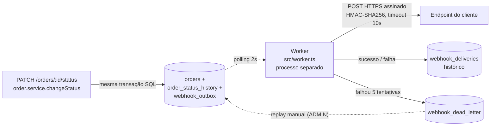

# RFC — Sistema de Webhooks de Notificação de Pedidos

| Campo | Valor |
|---|---|
| **RFC** | 001 |
| **Título** | Sistema de Webhooks de Notificação de Pedidos |
| **Autor** | Ricardo Medeiros |
| **Status** | Em revisão |
| **Data** | 2026-09-23 |
| **Revisores** | Larissa (Tech Lead), Marcos (Product Manager), Bruno (Eng. Pleno — Pedidos), Diego (Eng. Sênior — Plataforma), Sofia (Eng. Segurança) |
| **Fonte** | `TRANSCRICAO.md` — reunião técnica de ~55 min, quinta-feira 09:00 |
| **Documentos relacionados** | [PRD](PRD.md) · [FDD](FDD.md) · [ADRs](adrs/README.md) · [Tracker](TRACKER.md) |

> Este RFC apresenta a proposta técnica em nível de arquitetura, para revisão da equipe.
> O detalhamento de implementação — contratos, payloads, matriz de erros e modelo de dados — está no [FDD](FDD.md).
> Cada decisão fechada tem seu próprio registro em [`docs/adrs/`](adrs/README.md).

---

## 1. Resumo executivo (TL;DR)

Propomos notificar clientes B2B sobre mudanças de status de pedido através de **webhooks outbound**, construídos sobre o **padrão Outbox no MySQL já existente**.

Quando o status de um pedido muda, a mesma transação que atualiza `orders` e `order_status_history` insere o evento em uma tabela de outbox. Um **worker em processo separado**, em polling de 2 segundos, lê os eventos pendentes e faz as chamadas HTTP. Falhas entram em **retry com backoff exponencial** (5 tentativas, de 1 minuto a 12 horas) e, esgotadas as tentativas, o evento vai para uma **DLQ em tabela separada**, com replay manual por endpoint administrativo restrito a `ADMIN`.

Cada requisição é assinada com **HMAC-SHA256** usando uma secret única por endpoint, rotacionável com grace period de 24h. A entrega é **at-least-once**, e o cliente deduplica pelo `X-Event-Id`.

Nenhuma infraestrutura nova é introduzida: mesmo MySQL, mesmo Prisma, mesmo logger, mesmo padrão de módulos. A única dependência realmente nova é um cliente HTTP de saída, hoje inexistente no projeto.

**Estimativa:** três sprints, incluindo a revisão de segurança ([09:46] Larissa).

---

## 2. Contexto e problema

Três clientes B2B — Atlas Comercial, MaxDistribuição e Nova Cargo — pediram formalmente para serem notificados em tempo real quando o status de seus pedidos muda ([09:00] Marcos).

Hoje não existe alternativa: esses clientes fazem *polling* no `GET /orders` em intervalos regulares para descobrir se algo mudou, o que torna a integração lenta e cara do lado deles ([09:00] Marcos). Do nosso lado, o sistema **não tem nenhum mecanismo de notificação externa, evento ou fila** — uma varredura por `webhook`, `outbox` ou `queue` em `src/`, `prisma/` e `tests/` não retorna nada.

O problema tem prazo e consequência comercial: a Atlas indicou que pode migrar para um concorrente se a entrega não sair até o fim do trimestre ([09:00] Marcos), e o prazo pedido é fim de novembro ([09:45] Marcos).

O parâmetro de "tempo real" foi negociado e é explícito: **qualquer latência abaixo de 10 segundos** atende, desde que a notificação não fique pendurada ([09:02] Marcos).

O escopo é **exclusivamente outbound** — os clientes querem receber, não enviar ([09:02] Marcos e Sofia).

---

## 3. Proposta técnica

### 3.1 Visão geral

O fluxo tem três movimentos independentes:

1. **Produção do evento (síncrona, transacional).** Dentro do `$transaction` de `changeStatus`, após a inserção da linha de auditoria, o sistema insere o evento na outbox — desde que exista ao menos um webhook ativo do cliente interessado naquele status. Se a inserção falhar, a mudança de status sofre rollback: não pode existir caso de status mudar e evento não sair ([09:40] Bruno).
2. **Entrega (assíncrona).** O worker, em processo próprio, lê em batch os eventos pendentes mais antigos, monta os headers, assina e envia. Registra o resultado no histórico de entregas.
3. **Recuperação.** Falha ou timeout agenda nova tentativa segundo o backoff; esgotadas as cinco, o evento vai para a DLQ e só volta por ação humana.

### 3.2 Decisões estruturantes

- **Outbox no MySQL** em vez de disparo síncrono ou fila externa — garante atomicidade entre a mudança de status e a emissão do evento, sem infraestrutura nova → [ADR-001](adrs/ADR-001-outbox-no-mysql.md)
- **Worker em processo separado, polling de 2s** — ciclo de vida independente da API; 2s de latência no pior caso, dentro do teto de 10s → [ADR-002](adrs/ADR-002-worker-processo-separado-polling.md)
- **Retry 1m/5m/30m/2h/12h, 5 tentativas, DLQ em tabela separada** com replay manual restrito a `ADMIN` → [ADR-003](adrs/ADR-003-retry-backoff-exponencial-e-dlq.md)
- **HMAC-SHA256 com secret por endpoint**, rotação com grace de 24h, URL obrigatoriamente `https` → [ADR-004](adrs/ADR-004-hmac-sha256-com-secret-por-endpoint.md)
- **Entrega at-least-once**, dedup do lado do cliente pelo `X-Event-Id` → [ADR-005](adrs/ADR-005-entrega-at-least-once-com-x-event-id.md)
- **Reuso integral dos padrões do projeto** — módulo em `src/modules/webhooks`, `AppError`, Pino, middleware de erro, schemas Zod, prefixo `WEBHOOK_` nos códigos de erro → [ADR-006](adrs/ADR-006-reuso-dos-padroes-existentes-do-projeto.md)
- **Payload renderizado como snapshot na inserção**, para o evento refletir o estado do pedido no momento da transição → [ADR-007](adrs/ADR-007-payload-snapshot-na-insercao-do-outbox.md)

### 3.3 Superfície de API

Quatro grupos de endpoints, todos autenticados com o JWT já existente do sistema ([09:32] Marcos):

| Grupo | Finalidade | Autorização |
|---|---|---|
| CRUD de configuração de webhook | cadastrar, listar, editar e remover endpoints; filtro de quais status o endpoint quer ouvir | qualquer papel autenticado ([09:37] Sofia) |
| Rotação de secret | cliente solicita nova secret, antiga válida por mais 24h | qualquer papel autenticado |
| Histórico de entregas | consulta das últimas entregas com sucesso/falha, payload, resposta e tempo | qualquer papel autenticado |
| Replay de DLQ | recolocar evento morto na outbox | **`ADMIN` obrigatório**, com log de auditoria ([09:36] Sofia) |

O `customer_id` **não** vem do JWT: o token atual representa o usuário operador, não o cliente, então o identificador do cliente trafega no corpo ou no path ([09:32] Bruno, [09:32] Larissa).

O filtro de eventos é aplicado **na inserção** do outbox, não no envio: se nenhum webhook do cliente quer aquele status, a linha nem é criada ([09:34] Bruno e Diego).

Contratos completos, com payloads e status codes, estão no [FDD](FDD.md).

### 3.4 Integração com o código existente

O ponto de acoplamento é único e cirúrgico: o método `changeStatus` de `src/modules/orders/order.service.ts`. A proposta é uma função `publishWebhookEvent(tx, order, fromStatus, toStatus)` que recebe o `tx` da transação corrente, em vez de injetar um repository inteiro no `OrderService` ([09:41] Bruno e Diego).

Todo o resto — hierarquia de erros, logger, middleware de erro, validação Zod, `requireRole` — é reuso sem alteração ([09:29] Bruno). O detalhamento por arquivo está na seção "Integração com o sistema existente" do [FDD](FDD.md).

---

## 4. Alternativas consideradas

### 4.1 Disparo HTTP síncrono dentro do service de pedidos — **descartada**

Chamar o endpoint do cliente diretamente dentro de `changeStatus`.

**Trade-off que motivou o descarte:** acopla a latência de uma operação de negócio à disponibilidade de terceiros. A transação já é pesada — atualiza `orders`, insere em `order_status_history` e decrementa estoque —, e uma chamada HTTP no meio faria qualquer cliente lento travar a mudança de status de outros pedidos ([09:04] Bruno). Pior: com o cliente fora do ar, a única saída seria dar rollback numa mudança de status legítima ([09:04] Bruno). Descartada sem divergência ([09:06] Diego: "Síncrono está fora de questão").

### 4.2 Fila externa com Redis Streams — **descartada**

Publicar o evento em um broker dedicado e consumir de lá.

**Trade-off que motivou o descarte:** exige subir e operar infraestrutura nova, o que para um time pequeno foi classificado como overengineering ([09:07] Diego). Ganharia throughput e paralelismo que o volume atual não exige, e reintroduziria o problema de *dual write* — a transação do MySQL e a publicação no broker não são atômicas entre si — que é exatamente o que o outbox elimina. O MySQL existente resolve ([09:07] Diego).

### 4.3 Trigger de banco para acordar o worker — **descartada**

Substituir o polling por notificação reativa a partir do banco.

**Trade-off que motivou o descarte:** MySQL não tem listener nativo para processo externo, diferentemente do `NOTIFY`/`LISTEN` do PostgreSQL. Um trigger apenas executa SQL; para avisar o worker seria preciso improvisar escrita em arquivo ou chamada HTTP a partir do banco ([09:09] Diego). Como o polling de 2 segundos atende o requisito de 10 segundos com folga, a complexidade não se justifica.

### 4.4 Política de 3 tentativas de retry — **descartada**

**Trade-off que motivou o descarte:** esgotaria a janela em cerca de 30 minutos. Já houve cliente com indisponibilidade de duas horas em manutenção planejada, e eventos seriam descartados sem necessidade ([09:16] Diego). Cinco tentativas cobrem de 12 a 24 horas.

### 4.5 DLQ como flag na própria outbox — **descartada**

**Trade-off que motivou o descarte:** manter eventos mortos na tabela principal polui a varredura do worker. A tabela separada preserva payload e motivo da falha como evidência para debug e reprocessamento ([09:18] Diego), ao custo de uma tabela e uma movimentação de linha a mais.

### 4.6 Secret global da plataforma — **descartada**

**Trade-off que motivou o descarte:** o vazamento de uma única chave comprometeria a assinatura de todos os clientes ao mesmo tempo — "se vaza uma, vaza tudo" ([09:21] Sofia). O ganho seria apenas de gestão, e já existe histórico real de cliente vazando secret em log ([09:22] Diego).

---

## 5. Questões em aberto

Pontos levantados na reunião e **não decididos** — precisam de posição antes ou durante a implementação.

### 5.1 Rate limiting de saída por cliente

Diego levantou: se um cliente tem 50 pedidos mudando de status em um minuto, bombardeamos o endpoint dele com 50 chamadas? ([09:38])

A posição foi **observar e implementar se virar problema**, registrando como ponto em aberto ([09:39] Diego e Larissa). Não há decisão sobre limite, janela ou comportamento ao atingi-lo.

### 5.2 Estratégia de escala preservando ordering

O desenho atual garante ordem apenas por `order_id` e apenas enquanto houver um único worker ([09:12] Diego). Escalar para múltiplos workers quebra a garantia. Duas direções foram citadas — particionar por `order_id` ou usar lock pessimista — mas explicitamente tratadas como "problema do futuro" ([09:13] Diego). A limitação está documentada; a solução, não.

### 5.3 Retenção e arquivamento da outbox

Diego mencionou arquivar linhas entregues depois de uns 30 dias, e imediatamente colocou o tema **fora do escopo desta feature** ([09:08]). Sem política definida, a tabela cresce indefinidamente. Falta decidir prazo, destino das linhas e quem executa.

### 5.4 Endurecimento dos papéis no CRUD de configuração

Marcos perguntou se o CRUD pode ficar aberto a qualquer papel autenticado; Sofia respondeu "por enquanto sim", sinalizando que mais adiante pode ser endurecido ([09:37]). O critério e o momento dessa mudança não foram definidos.

### 5.5 Cliente HTTP a adotar

Ponto de implementação não discutido na reunião, identificado na análise do código: o `package.json` **não tem nenhum cliente HTTP** — sem axios, sem node-fetch. A escolha entre o `fetch` nativo do Node 20 e uma biblioteca externa está em aberto e precisa considerar o controle de timeout de 10 segundos exigido ([09:42] Diego).

---

## 6. Impacto e riscos

### 6.1 Impacto no sistema existente

| Área | Impacto |
|---|---|
| `src/modules/orders/order.service.ts` | Alteração cirúrgica no `changeStatus`: uma chamada dentro da transação existente. É o único ponto do domínio de pedidos que muda. |
| `prisma/schema.prisma` | Quatro tabelas novas e uma migration. Nenhuma tabela existente é alterada. |
| Middleware de erro, logger, validação | **Sem alteração** — os erros novos estendem `AppError` e são serializados pelo middleware atual ([09:29] Bruno). |
| Deploy / operação | Passa a existir um segundo processo (`npm run worker`) a ser provisionado, monitorado e reiniciado. É a mudança operacional mais relevante. |
| Banco | Carga adicional de escrita por mudança de status, mais leitura contínua de baixa intensidade pelo polling. |

### 6.2 Riscos

| Risco | Impacto | Mitigação |
|---|---|---|
| Worker único vira gargalo: um cliente lento consumindo 10s de timeout atrasa a fila inteira | Latência acima dos 10s acordados para outros clientes | Timeout curto ([09:42] Diego); métrica de idade do evento mais antigo pendente; questão 5.2 define o caminho de escala |
| Transação de `changeStatus` fica mais longa e ganha novo ponto de falha | Erro na outbox derruba a mudança de status | Trade-off aceito e deliberado ([09:41] Diego); escopo mínimo da operação — um `INSERT` local, sem I/O de rede |
| Crescimento indefinido da outbox sem política de arquivamento | Degradação progressiva do polling | Índices em status e `created_at` ([09:08] Diego); questão 5.3 em aberto |
| Vazamento de secret de cliente | Terceiro consegue forjar notificações para aquele endpoint | Secret por endpoint limita o raio ([09:21] Sofia); rotação autoatendida com grace de 24h; `redact` no logger |
| Cliente não implementar deduplicação por `X-Event-Id` | Processamento duplicado do lado do cliente | Documentação destacada no portal de desenvolvedor ([09:26] Marcos) |
| Prazo: Atlas sinalizou possível migração para concorrente | Perda de cliente B2B | Escopo enxuto, com e-mail, dashboard e rate limiting deliberadamente fora ([09:37], [09:40] Larissa) |

### 6.3 Condição de deploy

Sofia condicionou a subida à sua revisão de segurança, com **dois dias úteis reservados** para revisar HMAC e geração de secret antes do deploy ([09:46]). A estimativa de três sprints já inclui essa revisão ([09:47] Larissa).

---

## 7. Decisões relacionadas

| ADR | Decisão |
|---|---|
| [ADR-001](adrs/ADR-001-outbox-no-mysql.md) | Padrão Outbox no MySQL |
| [ADR-002](adrs/ADR-002-worker-processo-separado-polling.md) | Worker em processo separado com polling de 2s |
| [ADR-003](adrs/ADR-003-retry-backoff-exponencial-e-dlq.md) | Retry com backoff exponencial e DLQ |
| [ADR-004](adrs/ADR-004-hmac-sha256-com-secret-por-endpoint.md) | HMAC-SHA256 com secret por endpoint |
| [ADR-005](adrs/ADR-005-entrega-at-least-once-com-x-event-id.md) | Entrega at-least-once com `X-Event-Id` |
| [ADR-006](adrs/ADR-006-reuso-dos-padroes-existentes-do-projeto.md) | Reuso dos padrões existentes do projeto |
| [ADR-007](adrs/ADR-007-payload-snapshot-na-insercao-do-outbox.md) | Payload como snapshot na inserção |

---

## 8. O que este RFC não cobre

Itens explicitamente **fora do escopo** desta fase, por decisão registrada na reunião:

- **Notificação por e-mail** ao cliente quando o webhook dele falha — adiado para fase futura, após medir o impacto ([09:37] Larissa).
- **Dashboard visual** para o cliente acompanhar seus webhooks — projeto separado, do time de frontend ([09:40] Larissa).
- **Webhooks inbound** (cliente enviando para nós) — os clientes querem receber, não mandar ([09:02] Marcos).
- **Arquivamento das linhas entregues** da outbox ([09:08] Diego).
- **Rate limiting de saída** — em observação, ver questão 5.1.

Detalhamento de implementação (modelo de dados, contratos, matriz de erros `WEBHOOK_*`, observabilidade e critérios de aceite técnicos): [FDD](FDD.md).
